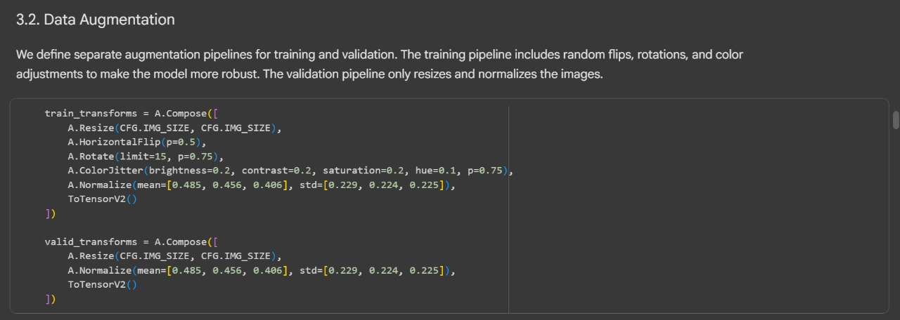

# Explorasi 1 Resnet34 (Sementara) 

Pada Data Augmention saya gunakan ada pada gambar dibawah 

Pada Tahap 1 saya menggunakan model plain34, dimana model ini tidak menggunakan skip conection dimana hasil dari traning menggunakan dataset pada tubes 1.Terdapat gambar dibawah menunjukkan hasil dari penggunaan model plain34 dengan tidak ada skip conection. Dari visual grafik dan angka nya menunjukkan hasil yang bagus dan terdapat peningkatan signifikan.

Sekarang Tahap 2 saya menggunakan ResNet34 dengan menggunakan skip connection, dari waktu training yang digunakan untuk tahap 2 ini lebih lama dibandingkan dengan waktu training pada tahap 1 tetapi untuk dari segi visual grafik dan angka menunjukkan perbedaan signifikan dimana pada tahap 2 ini lebih baik dibandingkan dengan tahap 1. Proses "menggabungkan" (out += self.shortcut(x)) inilah yang memakan waktu ekstra. Meskipun hanya operasi penjumlahan sederhana, operasi ini terjadi puluhan kali di dalam model, untuk setiap gambar, di setiap batch, dan di setiap epoch. Jika dijumlahkan, semua pekerjaan ekstra kecil ini membuat total waktu training menjadi sedikit lebih lama.

# Grafik Hasil Perbandingan Antara Plain34 dan ResNet34

Kenapa Training ResNet-34 (Tahap 2) Lebih Lama?
Pertanyaan yang sangat bagus! Waktu training Tahap 2 (ResNet-34) memang sedikit lebih lama karena ada operasi komputasi tambahan di setiap bloknya, yaitu proses Skip Connection itu sendiri.

Model Plain-34 :
Ini seperti jalur perakitan biasa. Setiap pekerja (layer) menerima barang dari pekerja sebelumnya, mengerjakannya, lalu memberikannya ke pekerja selanjutnya. Alurnya lurus, sederhana, dan cepat.

Model ResNet-34 :
Ini adalah pabrik yang lebih canggih. Setiap pekerja tidak hanya mengerjakan barang yang ia terima, tapi ia juga punya tugas tambahan: mengambil kembali barang asli sebelum diproses olehnya (lewat "jalur tol") dan menggabungkannya dengan hasil kerjanya.

Proses "mengambil dan menggabungkan" inilah skip connection (dalam kode: out += self.shortcut(x)). Meskipun kelihatannya sepele, ini adalah pekerjaan ekstra yang harus dilakukan di setiap blok, untuk setiap gambar, di setiap epoch. Jika dijumlahkan, semua pekerjaan ekstra kecil ini membuat total waktu training menjadi sedikit lebih lama.

Terutama saat ukuran gambar diubah (di awal stage 2, 3, dan 4), proses "penggabungan" ini bahkan memerlukan satu langkah konvolusi tambahan untuk menyamakan ukuran, yang menambah lebih banyak kalkulasi.

